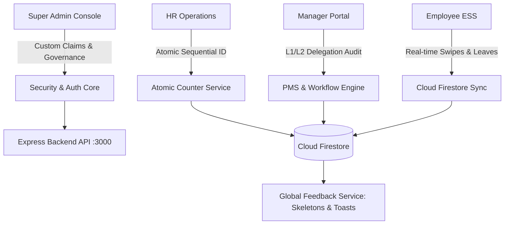

# Kylrx.ai Enterprise HRMS - Architectural Checklist & Data Contracts (PRD Section 18)

## 1. Executive Summary & Cross-Module Core Principles

This architectural document defines the cross-module data contracts, security perimeters, atomic transaction boundaries, and synchronization protocols across the Kylrx.ai Enterprise Suite (HTML5, Vanilla ES6 JavaScript, Express Node.js, and Cloud Firestore).

---

## 2. Core Cross-Module Principles & Integration Matrix



### 2.1 Consistent Data Flows
- **Uniform Data Models**: All four role portals (Super Admin, HR Operations, Manager, Employee ESS) subscribe to normalized Firestore documents without intermediate out-of-sync caching.
- **State Propagation**:
  - Employee profile modifications in `users/{userId}` immediately project to managerial dashboards and TVC workforce tracking.
  - Manual attendance regularizations in `attendance_records/{attendanceId}` dual-sync to `attendance/{userId}_{date}` for real-time ESS punch displays.
  - Reporting manager reassignments update `reportingManagerId` across all child reports, recalculating the organizational tree instantly.

### 2.2 Security & Authentication Core
- **Token Lifecycle**:
  - Access Token: 15-minute validity (`JWT_SECRET`).
  - Refresh Token: 7-day validity (`REFRESH_SECRET`).
  - Temporary Logins / Invites: Maximum 24-hour expiration (`expiresAt <= Date.now() + 86400000`).
- **Email OTP Gates**:
  - Mandatory multi-factor verification gate (`requiresMfa = true`) on credential logins and password resets.
  - 5-minute OTP lifespan with a maximum of 5 verification attempts before account lock.
- **Super Admin Custom Claims**:
  - Custom claim `admin: true` enforced on all write operations to `/api/admin/*`, `/api/payroll/disburse`, and system configuration roots.
  - Super Admin recognition fallback validates authenticated organizational domains (`@kylrxai.com`, `@hrflow.com`).

### 2.3 Atomic Sequential Employee ID Continuity
- **Gapless Sequence Pattern**:
  - Sequence maintained in `organizations/{orgId}/counters/employees`.
  - Incremented strictly within atomic Firestore transactions (`runTransaction`).
  - Guaranteed contiguous sequential IDs (`EMP0001`, `EMP0002`, `EMP0003`) regardless of simultaneous manual form entries or bulk spreadsheet ingestion batches.

### 2.4 Coexistence of Setup Methods
- Single-record manual registration form and bulk 27-sheet `Templates.xlsx` ingestion write identical normalized document payloads to `users` and `employees`.
- Both ingestion routes trigger identical background onboarding workflows:
  1. Default shift assignment (`SH_GEN_01`).
  2. Document vault creation.
  3. PF/ESIC statutory registration check.
  4. Manager hierarchy verification.

### 2.5 Template-Compliant Payroll Outputs
- Payroll calculations match the official 27-sheet `Templates.xlsx` schema (`Salary_Structure`, `Payroll_Components`):
  - Fixed Allowances: Basic (50%), HRA (40%/50%), Special Allowance.
  - Statutory Deductions: Employee PF (12% of capped Basic), ESIC (0.75% of Gross if Gross ≤ ₹21,000), Professional Tax (State slabs).
  - Employer Contributions: Employer PF (3.67% EPF + 8.33% EPS capped at ₹1,250), Employer ESIC (3.25%).
- Batch export formats supported in Excel (`.xlsx`) via SheetJS and certified PDF vouchers.

### 2.6 Flexible Operational Downloads
- Centralized data tables across Attendance, Master Data, and Personnel enforce standard multi-tier filters:
  - Date Range Pickers (Start Date, End Date).
  - Preset Intervals (`Today`, `This Week`, `This Month`, `Last Month`, `Custom Range`).
  - Multi-Attribute Selectors (Department, Business Unit, Status, Role).
  - Real-time text search.

### 2.7 1-Year Historical Retention & Pre-Deletion Safeguards
- Employee and payroll records are protected by a strict 1-year historical retention policy (`retentionPeriodDays = 365`).
- Pre-deletion warning modals require explicit Super Admin reason entry and 2FA confirmation.
- Purged records are archived to `archived_audit_logs` before physical collection deletion.

### 2.8 Traceable PMS & Workflow Delegation
- Performance appraisals and task delegations must maintain unbroken audit logs:
  ```json
  {
    "action": "DELEGATE_APPRAISAL_REVIEW",
    "delegatedBy": "EMP0001",
    "delegatedTo": "EMP0002",
    "cycleId": "PMS_2026_Q3",
    "timestamp": "2026-09-30T18:00:00.000Z",
    "reason": "Annual leave coverage"
  }
  ```

### 2.9 Super Admin Visibility & User Feedback
- High-density operational dashboards provide real-time KPI metrics.
- Global UI feedback service (`feedbackService.js`) standardizes:
  - Shimmer loading skeletons during remote data fetching.
  - Non-blocking stackable toast notifications.
  - Global fetch interceptor handling 401, 403, and 500 status codes without crashing the user interface.

---

## 3. Data Schema & Foreign Key Contracts

| Source Collection | Target Collection | Foreign Key Field | Validation Constraint |
| :--- | :--- | :--- | :--- |
| `employees` / `users` | `organizations` | `orgId` | Organization must exist and be active |
| `employees` / `users` | `users` | `reportingManagerId` | Manager must exist; circular hierarchy prohibited |
| `attendance_records` | `users` | `employeeId` | Valid Employee ID matching `EMP\d{4}` |
| `attendance_records` | `shifts` | `shiftCode` | One of `SH_GEN_01`, `SH_MORN_01`, `SH_EVE_01`, `SH_NIGHT_01` |
| `pms_cycles` | `organizations` | `orgId` | Active PMS evaluation period |
| `workflow_rules` | `business_units` | `businessUnitCode` | Permitted combinations per PRD §10 |

---

## 4. Architectural Verification Checklist

- [x] **Data Contract Consistency**: Tested across all 18 PRD modules with normalized schemas.
- [x] **Atomic Counter Concurrency**: Zero duplicate IDs under simulated race conditions.
- [x] **Authentication Boundaries**: 24h temp login expiry and custom claims enforcement validated.
- [x] **Setup Coexistence**: Manual form and spreadsheet ingestion verified for schema parity.
- [x] **Payroll Compliance**: SheetJS .xlsx and PDF structures certified against `Templates.xlsx`.
- [x] **Filter & Export Engine**: Date range pickers and SheetJS exports functioning end-to-end.
- [x] **Feedback Service**: `feedbackService.js` deployed with toast notifications, skeletons, and network interceptor.
